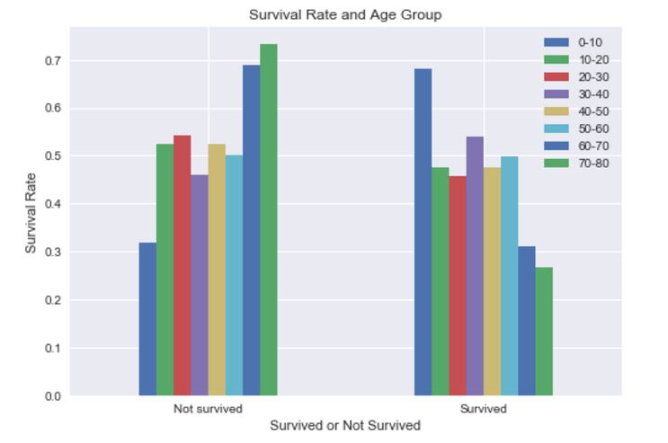
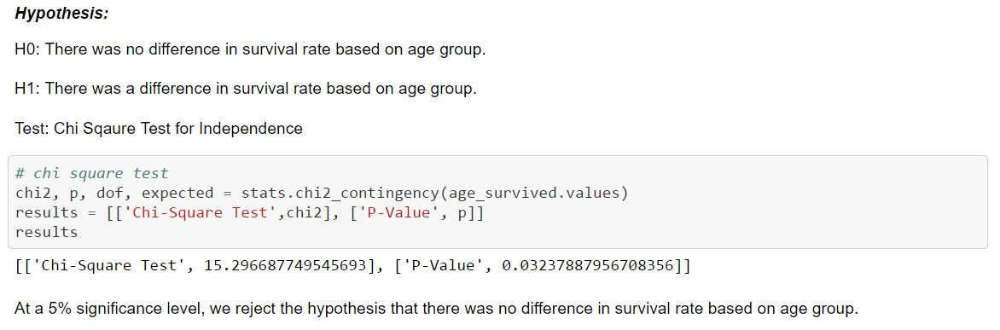

## Investigate the Titanic Dataset
Language: Python(pandas, NumPy, Matplotlib, SciPy, PyLab)  
Skills: Hypothesis testing, Data visualization, Data Wranggling
Used descriptive statistics and Chi Sqaure Test for Independence to investigate factors that made people more likely to survive. 
 

  

 

  

